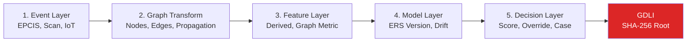

# Data Lineage Registry Engine v1.0

**End-to-End Decision Lineage — Audit-Grade**

---

## Core: Global Decision Lineage ID (GDLI)

```
GDLI = SHA-256(event_id + graph_state_version + model_version + threshold_version + timestamp)
```

GDLI is the root of every decision's lineage tree. Immutable. Replayable.

---

## Architecture



## 5 Audit Questions Answered

| Question | Layer | How |
|---|---|---|
| Which data influenced this decision? | 5→1 | GDLI → event_id → event_hash |
| Which event produced that data? | 1 | lineage_event_nodes |
| Which graph edge did that event create? | 2 | lineage_graph_transforms |
| Which feature used that edge? | 3 | lineage_feature_map + computation_hash |
| Which model + threshold scored it? | 4+5 | lineage_model_records + decision_lineage_registry |

## Engine: [data-lineage-engine.js](file:///Users/dangtranhai/Downloads/TrustChecker/server/engines/data-lineage-engine.js)

550 lines, 14 exports:

| Function | Purpose |
|---|---|
| `computeGDLI()` | Deterministic hash computation |
| `recordEventLineage()` | Layer 1: Event source, hash, geo |
| `recordGraphTransformation()` | Layer 2: Nodes/edges created, propagation |
| `recordFeatureLineage()` | Layer 3: Feature source, computation hash |
| `recordModelLineage()` | Layer 4: Version, drift, training run |
| `registerDecisionLineage()` | Layer 5: Score, action, override, GDLI |
| `recordFullLineage()` | All 5 layers in one call |
| `replayDecision()` | Determinism verification |
| `analyzeContamination()` | Blast radius analysis |
| `freezeLineage()` | Version lock on freeze |
| `maskPII()` | GDPR-safe: strip PII, keep hashes |
| `getFullLineage()` | Query full chain by GDLI |
| `boardLineageKPIs()` | Board-level metrics |

## Integration

L-RGF `processEvent()` → auto-creates GDLI chain. Every decision returns `gdli` field.

## Database: 5 tables + 9 indexes

`lineage_event_nodes`, `lineage_graph_transforms`, `lineage_feature_map`, `lineage_model_records`, `decision_lineage_registry`

## SoD: rbac.js → 16 conflict pairs

```
lineage:record ↔ lineage:modify
lineage:replay ↔ lineage:delete
```

Lineage record = IMMUTABLE. No role can modify.

## Verification

```
✅ data-lineage-engine.js — syntax pass, 14 exports
✅ lrgf-engine.js — GDLI integration, syntax pass
✅ rbac.js — 16 SoD pairs
✅ GDLI computation: 2a648bf67045714194e1a94e...
✅ All 4 engines load together: 65 total exports
```
