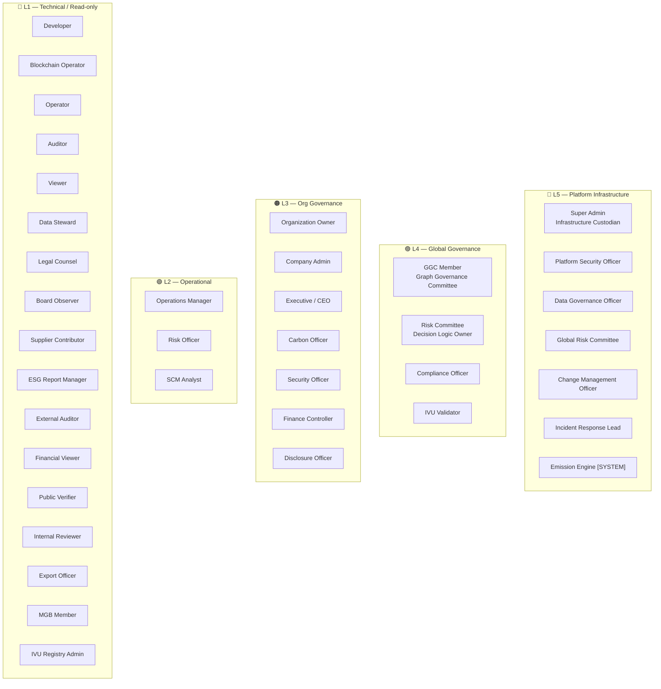

# TrustChecker v9.4.1 — Bản Giới Thiệu Chi Tiết Hệ Thống Role

## Tổng Quan

TrustChecker sử dụng mô hình **RBAC Phân Tầng (Hierarchical Role-Based Access Control)** cấp doanh nghiệp, thiết kế theo chuẩn **ISO 27001 / SOC 2 / Nasdaq governance**.

| Metric | Value |
|---|---|
| **Tổng số Role** | 37 (12 system + 25 business) |
| **Tổng Permissions** | 143+ granular permissions |
| **Tầng Authority** | 5 levels (L1 → L5) |
| **SoD Conflict Pairs** | 24 cặp phân tách nhiệm vụ |
| **Lineage ACL** | 13 entries |
| **MFA Policy** | Bắt buộc cho L3+ |

> **Lưu ý thuật ngữ**: Hệ thống đã chuyển từ "tenant" sang "org" (organization). Trong code, một số biến nội bộ vẫn dùng `tenant_id` nhưng business logic và UI đều dùng "org".

---

## Nguyên Tắc Thiết Kế

```
1. Platform ≠ Business     → Super Admin KHÔNG THỂ approve fraud hoặc mint carbon
2. Governance ≠ Execution  → L4 chỉ quản trị, L2 thực thi
3. Validation ≠ Deployment → IVU validate, KHÔNG THỂ deploy
4. Anchoring ≠ Minting     → Blockchain anchor, KHÔNG THỂ approve mint
5. Observability ≠ Data    → Security xem access logs, KHÔNG xem data
6. Không role nào có cả 3: create + approve + deploy
7. SoD Waiver             → Org-scoped, time-limited, audit-logged
```

---

## Kiến Trúc 5 Tầng (L1-L5 Authority Map)



---

## Chi Tiết Từng Role

### 🔴 L5 — Platform Infrastructure Layer

7 role cấp nền tảng. Quản lý hạ tầng, KHÔNG có quyền business.

---

#### 1. Super Admin (`super_admin`)
| | |
|---|---|
| **Mục đích** | Infrastructure Custodian — quản lý vòng đời platform, observability |
| **Authority Level** | L5 (cao nhất) |
| **MFA** | Bắt buộc |
| **User Type** | `platform` |

**Quyền chính:**
- Tạo/xóa/suspend tenant
- Quản lý billing, feature flags
- Xem audit logs toàn hệ thống
- Reset password Company Admin
- Cập nhật system configuration
- **Full sidebar access**

**🚫 KHÔNG có quyền (16):**
`fraud_case:approve`, `risk_model:create/approve/deploy`, `graph_weight:propose/approve`, `carbon_credit:request_mint/approve_mint/anchor`, `lineage:replay/view/impact`, `trust_score:view`, `evidence:seal`, `model_certification:issue`, `bias_audit:perform`

> **Thiết kế**: SA quản lý hạ tầng, KHÔNG tham gia quyết định business. Tránh conflict of interest.

---

#### 2. Platform Security Officer (`platform_security`)
| | |
|---|---|
| **Mục đích** | Bảo mật nền tảng — quản lý key, incident, giám sát quyền |
| **MFA** | Bắt buộc |
| **Permissions (10)** | `key:rotate`, `privileged_access:monitor`, `session_recording:review`, `api_access:approve`, `incident:declare/resolve`, `support_session:approve`, `platform_metrics:view`, `system_health:view`, `node_status:view` |

---

#### 3. Data Governance Officer (`data_gov_officer`)
| | |
|---|---|
| **Mục đích** | Quản trị dữ liệu — phân loại, lưu giữ, GDPR masking, chuyển dữ liệu xuyên biên giới |
| **Permissions (7)** | `data_classification:define/approve`, `retention_policy:approve`, `gdpr_masking:configure`, `cross_border_transfer:approve`, `lineage_export:approve`, `platform_metrics:view` |

---

#### 4. Global Risk Committee (`global_risk_committee`)
| | |
|---|---|
| **Mục đích** | Cấu hình trọng số risk scoring toàn cầu + ngưỡng anomaly |
| **⚠️ Giới hạn** | KHÔNG THỂ override CIP (Carbon Integrity Passport) |
| **Permissions** | `cie_risk_config:set_weights/set_threshold`, `cie_ivu_registry:manage/verify_qual` |

---

#### 5. Change Management Officer (`change_management_officer`)
| | |
|---|---|
| **Mục đích** | Quản lý system upgrade, change request, deployment freeze (ISO 27001 / SOC 2) |
| **Permissions** | `cie_change_mgmt:approve_upgrade/track_request/freeze_deploy` |

---

#### 6. Incident Response Lead (`incident_response_lead`)
| | |
|---|---|
| **Mục đích** | Kích hoạt incident protocol, freeze blockchain anchor, trigger forensic logging |
| **⚠️ Giới hạn** | KHÔNG THỂ sửa data |
| **Permissions** | `cie_incident:activate_protocol/freeze_anchor/trigger_forensic` |

---

#### 7. Emission Engine (`emission_engine`) — SYSTEM
| | |
|---|---|
| **Mục đích** | Non-human system role. Tính toán emission xác định (deterministic). Công thức bị khóa. |
| **MFA** | Không (non-human) |
| **⚠️** | KHÔNG có manual override |

---

### 🟣 L4 — Global Governance Layer

4 role quản trị toàn cục. Quyết định scoring logic, governance, validation.

---

#### 8. GGC Member (`ggc_member`) — Graph Governance Committee
| | |
|---|---|
| **Mục đích** | Structural governance — quản lý schema TrustGraph |
| **Quyền** | Schema: propose/approve/reject. Snapshot: view. Lineage: view |
| **⚠️ Giới hạn** | KHÔNG quản lý scoring logic (đó là Risk Committee) |

---

#### 9. Risk Committee (`risk_committee`) — Decision Logic Owner
| | |
|---|---|
| **Mục đích** | Sở hữu decision logic — risk scoring, trọng số, lineage replay, contamination analysis |
| **Permissions (17)** | `fraud:view/resolve`, `fraud_case:create/approve`, `anomaly:view/resolve`, `graph_weight:propose`, `graph_override:request/approve`, `risk_model:create/approve`, `lineage:view/replay/impact`, `lrgf_case:view/assign/override` |
| **⚠️** | KHÔNG THỂ deploy risk model (SoD: create ≠ deploy) |

---

#### 10. Compliance Officer (`compliance_officer`)
| | |
|---|---|
| **Mục đích** | Bảo vệ pháp lý — phê duyệt CIP compliance, quản lý GDPR, freeze compliance data |
| **Permissions (17)** | ESG: `view/export/manage`, Compliance: `view/manage/freeze`, `regulatory_export:approve`, `gdpr_masking:execute`, `carbon_credit:approve_mint`, Lineage: `view/replay/export`, CIE: `cie_passport:approve`, `cie_replay:forensic` |
| **SoD** | CÓ role duy nhất approve CIP compliance — KHÔNG THỂ modify calculation hoặc override IVU |

---

#### 11. IVU Validator (`ivu_validator`) — Independent Validation Unit
| | |
|---|---|
| **Mục đích** | Xác nhận độc lập CIP. Cấp validation status. |
| **Permissions** | `risk_model:validate`, `model_certification:issue`, `feature_drift:monitor`, `bias_audit:perform`, CIE: `cie_passport:validate`, `cie_replay:forensic` |
| **⚠️ Giới hạn** | KHÔNG THỂ modify data hoặc approve compliance |

---

### 🟠 L3 — Org Governance Layer

7 role cấp tổ chức (org). Quản lý nội bộ doanh nghiệp.

---

#### 12. Organization Owner (`org_owner`)
| | |
|---|---|
| **Mục đích** | **Tenant Sovereign Authority** — Định nghĩa không gian tổ chức, phạm vi rủi ro và cấu hình vận hành (economic entity) |
| **Control Plane** | Full quyền cấu hình: Feature Flags, Policy Engine, Integration (API/Webhooks) ở vi mô tenant. Biên giới giao tiếp ngoài. |
| **Risk Governance** | Thiết lập Risk Appetite (e.g., TCAR threshold) và Alert rules. Simulate rủi ro nhúng ERQF/Monte Carlo. |
| **Economic Control** | Toàn quyền kiểm soát tài chính: Phân rã gói cước, kích hoạt Add-ons, Cost Allocation. |
| **Blast Radius** | Toàn bộ tenant data, governance, exposure. ❌ Không ảnh hưởng hay lây lan sang tenant khác (Cross-tenant isolation). |
| **⚠️ Giới hạn** | KHÔNG được thay đổi mô hình tính toán thuật toán lõi (ERQF/Monte Carlo core models). Chỉ được Run/Simulate. |

---

#### 13. Company Admin (`company_admin`)
| | |
|---|---|
| **Mục đích** | IAM Controller — quản lý users/roles/config trong phạm vi tenant |
| **Quyền đặc biệt** | Tất cả tenant management: `user_create/update/delete/list`, `role_create/update/delete/list/assign`, `policy_create`, `audit_view`, `settings_update` |
| **⚠️ SoD** | KHÔNG THỂ grant governance permissions (SoD, compliance, risk deploy) |

---

#### 14. Executive / CEO (`executive`)
| | |
|---|---|
| **Mục đích** | Oversight — xem CIP status, risk heatmap, benchmark, governance |
| **Permissions** | Dashboard, trust score, stakeholder, risk radar, fraud (view), ESG, sustainability, compliance, reports + CIE: `cie_passport:view`, `cie_replay:view`, `cie_snapshot:view`, `cie_export:report/share` |
| **⚠️** | VIEW ONLY — KHÔNG THỂ edit data/methodology/approve CIP |

---

#### 15. Carbon Officer (`carbon_officer`)
| | |
|---|---|
| **Mục đích** | Submit emission data, tạo CIP draft, yêu cầu mint carbon credit |
| **Workflow** | Carbon Officer submit → Compliance approve → IVU validate → Blockchain anchor |
| **Permissions** | `carbon_data:upload`, `emission_model:submit`, `carbon_credit:request_mint/verify`, CIE: `cie_passport:submit/view`, `cie_replay:view` |
| **⚠️** | KHÔNG THỂ approve/seal/modify methodology |

---

#### 16. Security Officer (`security_officer`)
| | |
|---|---|
| **Mục đích** | Giám sát SoD conflicts, privilege escalation, access anomalies |
| **Permissions** | Dashboard, audit log, trust score, risk radar, compliance, reports, lineage (read-only), CIE audit (trail, SoD violations, change history, escalation) |
| **⚠️** | KHÔNG THỂ modify data hoặc approve business workflows |

---

#### 17. Finance Controller (`finance_controller`)
| | |
|---|---|
| **Mục đích** | Oversight tài chính — billing, treasury, fee, wallet |
| **Permissions** | `payment:view/approve` (SoD: KHÔNG có `payment:create`), `billing:view/manage`, `wallet:view/manage`, `fee:view/configure`, `treasury:view/manage` |
| **SoD Enforcement** | Chỉ approve payment, KHÔNG THỂ tạo payment (ngăn self-approve) |

---

#### 18. Disclosure Officer (`disclosure_officer`)
| | |
|---|---|
| **Mục đích** | Sign-off công bố carbon. Liên kết CIP với báo cáo thường niên. Xác nhận CSRD/ESRS. |
| **⚠️** | Chịu trách nhiệm pháp lý cá nhân (personal liability) |
| **Permissions** | `cie_disclosure:sign_off/link_annual_report/certify_csrd/view_liability` |

---

### 🟢 L2 — Operational Layer

3 role vận hành. Thực thi nghiệp vụ hàng ngày.

---

#### 19. Operations Manager (`ops_manager`)
| | |
|---|---|
| **Mục đích** | Full operations & supply chain access |
| **Permissions (27)** | Product CRUD + export, scan, QR generate, evidence (view/upload/verify), stakeholder manage, full SCM (supply chain, inventory, logistics, partners, EPCIS, TrustGraph, Digital Twin simulate) |

---

#### 20. Risk Officer (`risk_officer`)
| | |
|---|---|
| **Mục đích** | Giám sát rủi ro và điều tra fraud |
| **Permissions** | `fraud:view/resolve`, `fraud_case:create`, `risk_radar:view`, `anomaly:view/create/resolve`, `leak_monitor:view`, `ai_analytics:view`, `kyc:view/manage` |

---

#### 21. SCM Analyst (`scm_analyst`)
| | |
|---|---|
| **Mục đích** | Phân tích route risk, supply chain graph, partner scoring |
| **Permissions** | Full SCM: `supply_chain:view/manage`, `logistics:view/manage`, `partner:view/manage`, `epcis:view/create`, `trustgraph:view`, `digital_twin:view/simulate`, `risk_radar:view`, `carbon_credit:verify` |

---

### 🔵 L1 — Technical Execution & Read-Only Layer

17 role chuyên biệt. Quyền hạn hẹp, nhiệm vụ cụ thể.

---

#### 22. Developer (`developer`)
| Quyền | API key manage, webhook manage, blockchain view, product/scan view |
|---|---|

#### 23. Blockchain Operator (`blockchain_operator`)
| Quyền | Anchor/verify blockchain hashes, NFT view, carbon credit anchor/verify |
|---|---|
| **⚠️** | Chỉ thấy hash + timestamp + signature. KHÔNG thấy nội dung CIP |

#### 24. Operator (`operator`)
| Quyền | Nghiệp vụ hàng ngày: product CRUD, scan, QR generate, evidence upload, inventory view |
|---|---|

#### 25. Auditor (`auditor`) — Internal Audit
| Quyền | Full audit trail, SoD violation attempts, change history, replay log. CIE: forensic replay, snapshot |
|---|---|
| **⚠️** | KHÔNG THỂ modify hoặc approve bất kỳ thứ gì |

#### 26. Viewer (`viewer`)
| Quyền | Read-only: dashboard, product, scan, trust score, reports |
|---|---|

#### 27. Data Steward (`data_steward`)
| Quyền | Validate data completeness, reject incomplete submissions, manage metadata quality |
|---|---|
| **Workflow** | Hoạt động TRƯỚC Carbon Officer — gateway kiểm tra chất lượng dữ liệu |

#### 28. Legal Counsel (`legal_counsel`)
| Quyền | View sealed CIP, methodology version, liability mapping, responsibility allocation |
|---|---|
| **⚠️** | KHÔNG THỂ modify hoặc approve. Critical cho public disclosure & regulatory inquiry |

#### 29. Board Observer (`board_observer`)
| Quyền | Read-only strategic oversight cho Board/Audit Committee |
|---|---|

#### 30. Supplier Contributor (`supplier_contributor`)
| Quyền | Submit supplier emission declaration + upload docs |
|---|---|
| **⚠️** | KHÔNG THỂ xem full CIP, approve, hoặc xem system benchmarks. Org-isolated |

#### 31. ESG Reporting Manager (`esg_reporting_manager`)
| Quyền | Generate consolidated ESG reports, portfolio carbon reports, investor disclosures |
|---|---|

#### 32. External Auditor (`external_auditor`)
| Quyền | Time-bound, logged, auto-revoked. Read-only snapshot, verify hash, sandbox replay |
|---|---|
| **⚠️** | KHÔNG THỂ modify bất kỳ thứ gì |

#### 33. Financial Viewer (`financial_viewer`)
| Quyền | Scoped, NDA-bound. View Carbon Integrity Score + selected CIP + verify hash |
|---|---|
| **⚠️** | KHÔNG xem supplier confidential data |

#### 34. Public Verifier (`public_verifier`)
| Quyền | Verify CIP via QR, check hash, confirm seal status |
|---|---|
| **⚠️** | Minimal authentication. KHÔNG xem internal governance |

#### 35. Internal Reviewer (`internal_reviewer`)
| Quyền | Review CIP data quality, comment, request revision |
|---|---|
| **⚠️** | KHÔNG THỂ seal hoặc approve |

#### 36. Export Officer (`export_officer`)
| Quyền | Export reports, share CIP, generate PDF |
|---|---|

#### 37. MGB Member (`mgb_member`) — Methodology Governance Board
| Quyền | Propose/vote methodology versions, freeze emission factors |
|---|---|
| **⚠️** | KHÔNG phải nhân viên tenant. KHÔNG access org data. |

---

## SoD Conflict Matrix — 24 Cặp Phân Tách

> **Separation of Duties (SoD)**: Không một người nào có thể vừa TẠO vừa PHÊ DUYỆT cùng một hành động.

| # | Action A | Action B | Mô tả |
|---|---|---|---|
| 1 | `fraud_case:create` | `fraud_case:approve` | Tạo ≠ Phê duyệt case fraud |
| 2 | `payment:create` | `payment:approve` | Tạo ≠ Phê duyệt thanh toán |
| 3 | `user:create` | `user:approve` | Tạo ≠ Phê duyệt user |
| 4 | `role:create` | `role:approve` | Tạo ≠ Phê duyệt role |
| 5 | `risk_model:create` | `risk_model:deploy` | Tạo ≠ Triển khai risk model |
| 6 | `risk_model:deploy` | `risk_model:approve` | Triển khai ≠ Phê duyệt |
| 7 | `evidence:create` | `evidence:seal` | Tạo evidence ≠ Niêm phong |
| 8 | `compliance:freeze` | `compliance:export` | Đóng băng ≠ Xuất dữ liệu |
| 9 | `threshold:configure` | `threshold:override` | Cấu hình ≠ Override ngưỡng |
| 10 | `event:ingest` | `event:delete` | Nhập event ≠ Xóa event |
| 11 | `case:assign` | `case:close` | Giao case ≠ Đóng case |
| 12 | `graph_schema:approve` | `graph_schema:deploy` | Duyệt schema ≠ Deploy schema |
| 13 | `graph_weight:propose` | `graph_weight:approve` | Đề xuất weight ≠ Duyệt weight |
| 14 | `graph_override:request` | `graph_override:approve` | Yêu cầu override ≠ Duyệt override |
| 15 | `lineage:record` | `lineage:modify` | Ghi lineage ≠ Sửa lineage |
| 16 | `lineage:replay` | `lineage:delete` | Replay ≠ Xóa lineage |
| 17 | `lineage:view_full` | `lineage:export` | Xem full ≠ Export raw |
| 18 | `lineage:approve_export` | `lineage:perform_export` | Duyệt export ≠ Thực hiện export |
| 19 | `carbon_credit:request_mint` | `carbon_credit:approve_mint` | Yêu cầu mint ≠ Duyệt mint |
| 20 | `carbon_credit:approve_mint` | `carbon_credit:anchor` | Duyệt mint ≠ Anchor blockchain |
| 21 | `support_session:initiate` | `support_session:approve` | Khởi tạo ≠ Duyệt support |
| 22 | `incident:declare` | `incident:resolve` | Khai báo incident ≠ Giải quyết |
| 23 | `data_classification:define` | `data_classification:approve` | Định nghĩa ≠ Duyệt phân loại |
| 24 | `lineage_export:approve` | `lineage_export:execute` | Duyệt export ≠ Thực thi export |

### SoD Waiver API
Tổ chức nhỏ (<50 người) có thể tạo waiver:
```
GET  /api/sod/conflicts     → Liệt kê 24 conflict pairs
GET  /api/sod/waivers       → Liệt kê waivers đang hoạt động
POST /api/sod/waivers       → Tạo waiver (pair + reason + expiry)
DEL  /api/sod/waivers       → Hủy waiver
```
Waivers: tenant-scoped, time-limited, fully audit-logged.

---

## Carbon Integrity Passport (CIP) — SoD Workflow

```
┌─────────────┐     ┌──────────────┐     ┌─────────────┐     ┌──────────────┐     ┌──────────────┐
│ Data Steward │ →   │ Carbon       │ →   │ Internal    │ →   │ Compliance   │ →   │ IVU          │
│ Validate     │     │ Officer      │     │ Reviewer    │     │ Officer      │     │ Validator    │
│ completeness │     │ Submit CIP   │     │ Quality     │     │ Approve CIP  │     │ Independent  │
│              │     │ draft        │     │ review      │     │              │     │ validation   │
└─────────────┘     └──────────────┘     └─────────────┘     └──────────────┘     └──────────────┘
                                                                                          │
                                                                                          ▼
                                                              ┌──────────────┐     ┌──────────────┐
                                                              │ Disclosure   │ ←   │ Blockchain   │
                                                              │ Officer      │     │ Operator     │
                                                              │ Sign-off     │     │ Anchor hash  │
                                                              │ CSRD/ESRS    │     │              │
                                                              └──────────────┘     └──────────────┘
```

**6 hands, 6 different roles** — mỗi bước bởi một role khác nhau, đảm bảo không ai có quyền create + approve + deploy.

---

## Lineage Access Matrix

| Role | Access Level | Replay | Impact Analysis | Modify |
|---|---|---|---|---|
| Super Admin | Metadata only | ❌ | ❌ | ❌ |
| Platform Security | None | ❌ | ❌ | ❌ |
| Data Gov Officer | Summary | ❌ | ❌ | ❌ |
| Risk Committee | **Full 5-layer** | ✅ | ✅ | ❌ |
| Compliance | **Full 5-layer** | ✅ | ❌ | ❌ |
| IVU | **Full 5-layer** | ✅ | Limited | ❌ |
| Company Admin | Org summary | ❌ | ❌ | ❌ |
| CEO | Dashboard only | ❌ | ❌ | ❌ |
| Carbon Officer | Decision only | ❌ | ❌ | ❌ |
| Ops/Operator | Decision outcome | ❌ | ❌ | ❌ |
| Auditor | Summary + audit log | ❌ | ❌ | ❌ |
| Developer | Ingestion only | ❌ | ❌ | ❌ |
| Blockchain Op | Hash only | ❌ | ❌ | ❌ |

---

## Permission Categories — 143+ Permissions

### Platform Level (9 permissions)
`platform:tenant_create/suspend/delete/list`, `billing_update`, `feature_flag`, `audit_view_all`, `admin_reset`, `support_override`

### Org Management (12 permissions)
`tenant:user_create/update/delete/list`, `role_create/update/delete/list/assign`, `policy_create`, `audit_view`, `settings_update`

### Business Level (120+ permissions)

| Category | Count | Ví dụ |
|---|---|---|
| **Dashboard** | 1 | `dashboard:view` |
| **Product** | 5 | `product:view/create/update/delete/export` |
| **QR & Scan** | 3 | `scan:view/create`, `qr:generate` |
| **Evidence** | 5 | `evidence:view/upload/verify/delete/freeze/seal` |
| **Trust & Stakeholder** | 3 | `trust_score:view`, `stakeholder:view/manage` |
| **Supply Chain** | 12 | `supply_chain:view/manage`, `inventory:*`, `logistics:*`, `partner:*`, `epcis:*` |
| **Digital Twin** | 3 | `trustgraph:view`, `digital_twin:view/simulate` |
| **Risk & Fraud** | 8 | `fraud:view/resolve`, `fraud_case:create/approve`, `risk_radar:view`, `anomaly:*` |
| **KYC** | 2 | `kyc:view/manage` |
| **ESG & Carbon** | 8 | `esg:view/export/manage`, `sustainability:view/create/manage` |
| **Compliance** | 5 | `compliance:view/manage/freeze`, `regulatory_export:approve`, `gdpr_masking:execute` |
| **Blockchain & NFT** | 6 | `blockchain:view/create`, `blockchain_anchor:*`, `nft:view/mint` |
| **Billing & Finance** | 10 | `billing:*`, `payment:*`, `fee:*`, `treasury:*`, `wallet:*` |
| **Graph Governance** | 8 | `graph_schema:propose/approve/reject/deploy`, `graph_weight:*`, `graph_override:*` |
| **Risk Model** | 4 | `risk_model:create/deploy/approve/validate` |
| **Lineage** | 6 | `lineage:view/replay/impact/export/view_summary` |
| **CIE Passport** | 16+ | `cie_passport:submit/calculate/review/validate/approve/seal/view`, `cie_replay:*`, `cie_export:*` |
| **CIE Governance** | 12+ | `cie_methodology:*`, `cie_risk_config:*`, `cie_ivu_registry:*` |
| **CIE Enterprise** | 10+ | `cie_data:*`, `cie_audit:*`, `cie_liability:*`, `cie_escalation:*` |
| **CIE Supply Chain** | 6+ | `cie_supplier:*`, `cie_esg:*`, `cie_external_audit:*` |
| **CIE Institutional** | 8+ | `cie_finance:*`, `cie_public:*`, `cie_change_mgmt:*`, `cie_incident:*`, `cie_disclosure:*` |

---

## Test Accounts

### Platform Accounts (`@trustchecker.io`) — Quản trị hạ tầng

| Email | Role | Chức năng |
|---|---|---|
| `admin@trustchecker.io` | **Super Admin** | Quản trị hạ tầng toàn nền tảng |
| `security@trustchecker.io` | **Platform Security** | Key rotation, incident, session monitoring |
| `datagov@trustchecker.io` | **Data Governance Officer** | Classification, retention, GDPR masking |

### Company Accounts (`@tonyisking.com`) — Công ty Tony is King

#### L3 — Org Governance

| Email | Role | Chức năng |
|---|---|---|
| `admin@tonyisking.com` | **Company Admin** | Quản lý user/role trong tenant, IAM controller |
| `ceo@tonyisking.com` | **Executive / CEO** | Dashboard, reports, CIE oversight |
| `carbon@tonyisking.com` | **Carbon Officer** | Emission data, carbon mint request |
| `compliance@tonyisking.com` | **Compliance Officer** | GDPR, CIE passport approve, audit log |

#### L4 — Governance

| Email | Role | Chức năng |
|---|---|---|
| `ggc@tonyisking.com` | **GGC Member** | Graph schema propose/approve/reject |
| `riskcom@tonyisking.com` | **Risk Committee** | Risk scoring, fraud approve, lineage replay |
| `ivu@tonyisking.com` | **IVU Validator** | Model certification, bias audit, CIE validate |

#### L2 — Operational

| Email | Role | Chức năng |
|---|---|---|
| `ops@tonyisking.com` | **Operations Manager** | Product, QR, scan, SCM, inventory, logistics |
| `risk@tonyisking.com` | **Risk Officer** | Fraud investigate, anomaly, KYC |
| `scm@tonyisking.com` | **SCM Analyst** | Supply chain graph, route risk, partner scoring |

#### L1 — Technical / Read-only

| Email | Role | Chức năng |
|---|---|---|
| `dev@tonyisking.com` | **Developer** | API key, webhook, blockchain view |
| `blockchain@tonyisking.com` | **Blockchain Operator** | Anchor/verify, NFT, carbon credit anchor |
| `operator@tonyisking.com` | **Operator** | Product CRUD, scan, QR, evidence upload |
| `auditor@tonyisking.com` | **Auditor** | Read-only audit trail, compliance, reports |
| `viewer@tonyisking.com` | **Viewer** | Read-only: dashboard, products, scans |

> **Mật khẩu mặc định**: `123qaz12` (bắt buộc đổi khi đăng nhập lần đầu)
> **Công ty**: Tony is King (plan: enterprise)
> **Seed script**: `node scripts/seed-tonyisking.js`

---

## Tiêu Chuẩn Tuân Thủ

| Standard | Coverage |
|---|---|
| **ISO 27001** | Access control, change management, incident response |
| **SOC 2** | Separation of duties, audit logging, key rotation |
| **Nasdaq Governance** | Infrastructure-neutral positioning, multi-tier authority |
| **CSRD/ESRS** | Carbon disclosure officer, liability mapping |
| **GHG Protocol** | Emission engine, CIE passport workflow |
| **GDPR** | Data governance officer, masking, retention, cross-border |

---

> **TrustChecker v9.4.1** — 37 roles × 143 permissions × 24 SoD pairs × 5 authority layers
> Enterprise-grade RBAC cho institutional supply chain trust, compliance, và governance.
